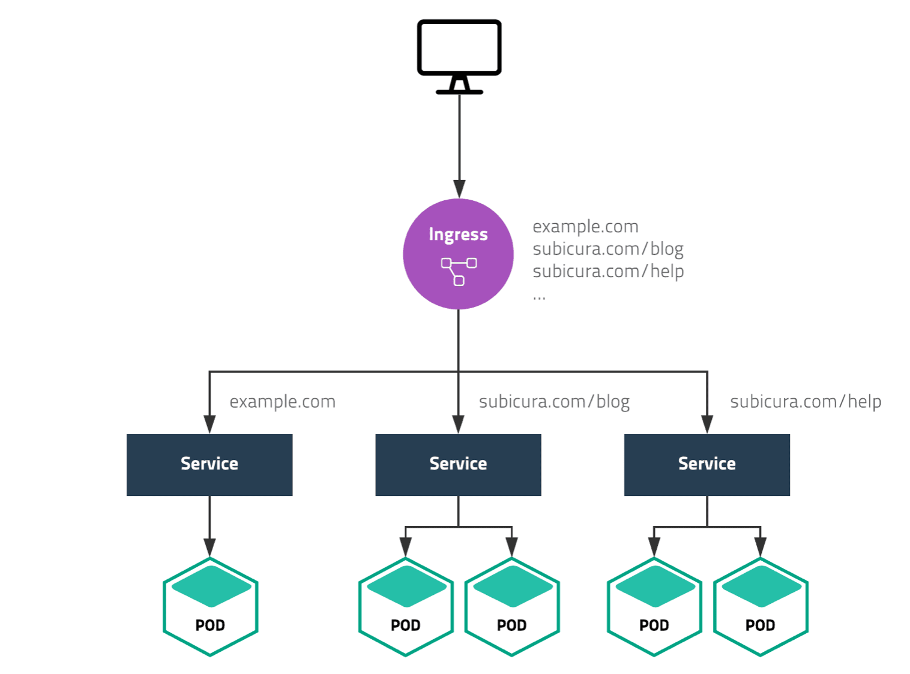

# Ingress

하나의 클러스터에서 여러 가지 서비스를 운영한다면 외부 연결을 어떻게 해야할까? 
NodePort를 이용하면 서비스 개수만큼 포트를 오픈하고 사용자에게 어떤 포트인지 알려줘야 한다.

 

xample.com, subicura.com/blog, subicura.com/help 주소로 서로 다른 서비스에 접근하는 모습이다. 
80(http) 또는 443(https) 포트로 여러 개의 서비스를 연결해야 하는데 이럴 때 Ingress를 사용한다.


#### Ingress 만들기
echo 웹 애플리케이션을 버전별로 도메인을 다르게 만들어 본다

minikube ip로 테스트 클러스터의 노드 IP를 구하고 도메인 주소로 사용한다. 
결과 IP가 192.168.64.5라면 사용할 도메인은 다음과 같습니다.

* v1.echo.192.168.49.2.sslip.io
* v2.echo.192.168.49.2.sslip.io


    도메인을 테스트하려면 여러가지 설정이 필요하다.
    여기서는 별도의 설정없이 IP주소를 도메인에 넣어 바로 사용할 수 있는 sslip.io 서비스를 이용한다.

#### minikube에 Ingress 활성화 하기

Ingress는 Pod, ReplicaSet, Deployment, Service와 달리 별도의 컨트롤러를 설치해야 한다. 
여러 가지 컨트롤러 중에 입맛에 맞게 고를 수 있는데 여기서는 nginx ingress controller를 사용한다.

    nginx를 제외한 대표적인 컨트롤러로 haproxy, traefik, alb등이 있습니다.


```shell
minikube addons enable ingress

roadseeker@DESKTOP-ARE0NV9:~/k8s_guide/example$ minikube addons enable ingress
💡  ingress is an addon maintained by Kubernetes. For any concerns contact minikube on GitHub.
You can view the list of minikube maintainers at: https://github.com/kubernetes/minikube/blob/master/OWNERS
    ▪ Using image registry.k8s.io/ingress-nginx/controller:v1.9.4
    ▪ Using image registry.k8s.io/ingress-nginx/kube-webhook-certgen:v20231011-8b53cabe0
    ▪ Using image registry.k8s.io/ingress-nginx/kube-webhook-certgen:v20231011-8b53cabe0
🔎  Verifying ingress addon...
🌟  The 'ingress' addon is enabled

# ingress 컨트롤러 확인
kubectl -n ingress-nginx get pod


roadseeker@DESKTOP-ARE0NV9:~/k8s_guide/example$ kubectl -n ingress-nginx get pod
NAME                                        READY   STATUS      RESTARTS   AGE
ingress-nginx-admission-create-sjw65        0/1     Completed   0          2m46s
ingress-nginx-admission-patch-58d4l         0/1     Completed   0          2m46s
ingress-nginx-controller-7c6974c4d8-7s5sz   1/1     Running     0          2m46s


```

```shell
curl -I http://192.168.49.2/healthz # minikube ip를 입력


roadseeker@DESKTOP-ARE0NV9:~/k8s_guide/example$ curl -I http://192.168.49.2/healthz
HTTP/1.1 200 OK
Date: Wed, 29 Nov 2023 08:25:51 GMT
Content-Type: text/html
Content-Length: 0
Connection: keep-alive

```

    Docker driver를 사용중이라면 minikube service ingress-nginx-controller -n ingress-nginx --url 명령어를 이용하여 접속 주소를 확인한다


#### echo 웹 애플리케이션 배포
    Docker driver를 사용중이라면 rules.host부분에 127.0.0.1을 사용합니다. v1.echo.127.0.0.1.sslip.io

